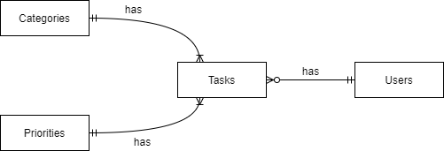

# Design Document

By Tin Hui Hui

Video overview: https://youtu.be/IlkwtTcZ0JM

## Scope

The purpose of this database is to facilitate the management of to-dos, tasks, and deadlines, which provides a structured system for users to track and organise their tasks based on parameters like name, description, status, due date, category, and priority.

Included in the database's scope is:

* Tasks, including a unique identifier (id), a name, an optional description, a status (Pending, Completed, Overdue), a due date, a category, a priority, and an association with a user.
* Categories, including a unique identifier (id), and the name of categories (Work, Personal, School).
* Priorities, including a unique identifier (id), and the name of priorities (High, Medium, Low).
* Users, including a unique identifier (id), a username, and a password.

Out of scope are elements like:
* Collaboration features for multiple users.
* Advanced user authentication like multi-factor authentication.

## Functional Requirements

This database will support:

* Users shall be able to perform CRUD operation on tasks.
* Users shall be able to create new tasks with a name, an optional description, status, due date, category, and priority.
* Users shall be able to view details of existing tasks, such as the name, description, status, due date, category, and priority.
* Users shall be able to filter tasks based on their status (Pending, Completed, Overdue), category, and priority.
* Users shall be able to sort tasks based on their due dates.
* Users shall be able to update task details, including the name, description, due date, category, priority, and status.
* Users shall be able to mark tasks as completed.
* Users shall be able to delete tasks.

Note that in this iteration, the system will not support advanced reporting features, for example performance metrics, task completion trends, or historical data analysis of tasks.

## Representation

Entities are captured in SQLite tables with the following schema.

### Entities

The database includes the following entities:

### Tasks

The `tasks` table includes:

* `id`, which is the unique ID for the particular task as an `INTEGER`. This column has the `PRIMARY KEY` constraint applied.
* `name`, which is the name of the particular task as `TEXT`, as `TEXT` is suitable for name fields.
* `description`, which is a description of the task as `TEXT`, as `TEXT` is suitable for strings.
* `status`, which is the status of a particular task as `TEXT`. This column has the `CHECK` constraint applied to check if the status is only Pending, Completed, or Overdue.
* `category_id`, which is the ID of the category of the task as an `INTEGER`. This column has the `FOREIGN KEY` constraint applied, referencing the `id` column in the `categories` table to ensure data integrity.
* `priority_id`, which is the ID of the priority of the task as an `INTEGER`. This column has the `FOREIGN KEY` constraint applied, referencing the `id` column in the `priorities` table to ensure data integrity. The ID of 1 represents the highest priority, and the ID of 3 represents the lowest priority.

All columns in the `tasks` table are required except `description` and hence have the `NOT NULL` constraint applied.
Users can choose to either add a description or not.

### Categories

The `categories` table includes:

* `id`, which is the unique ID for the category as an `INTEGER`. This column has the `PRIMARY KEY` constraint applied.
* `name`, which is the name of a particular category as `ENUM` as there are only 3 categories, which are `work`, `personal`, and `school`.

All columns in the `categories` table are required and hence should have the `NOT NULL` constraint applied. No other constraints are necessary.

### Priorities

The `priorities` table includes:

* `id`, which is the unique ID for the priority as an `INTEGER`. This column has the `PRIMARY KEY` constraint applied.
* `name`, which is the name of a particular priority as `TEXT`. This column has the `CHECK` constraint applied to check if the priotity is only High, Medium, or Low.

All columns in the `priorities` table are required and hence should have the `NOT NULL` constraint applied. No other constraints are necessary.

### Users

The `users` table includes:

* `id`, which is the unique ID for the user as an `INTEGER`. This column has the `PRIMARY KEY` constraint applied.
* `username`, which is the name of the particular user as `TEXT`, as `TEXT` is suitable for name fields. The `UNIQUE` constraint is applied as there can only be unique usernames for each user.
* `password`, which is the password for the user as `TEXT`.

All columns in the `users` table are required and hence should have the `NOT NULL` constraint applied. No other constraints are necessary.

### Relationships

As detailed by the diagram:

* A category is associated with 1 to many tasks. At the same time, a task is associated with one and only one category. It is assumed that a task can only have one category.
* A priority is associated with 1 to many tasks. At the same time, a task is associated with one and only one priority. It is assumed that a task can only have one priority.
* A user has 0 to many tasks. At the same time, a task is associated with one and only one user. It is assumed that users cannot share the same task.

## Optimizations

Based on the queries in `queries.sql`, it is common for users of the database to view the details of tasks. For that reason, indexes are created on the `status`, `category_id`, `priority_id`, `due_date` and `user_id` columns to speed the identification of tasks by those columns.

## Limitations

Some limitations of this design are:
* Collaboration features for multiple users.
* Advanced user authentication like multi-factor authentication.
* Users cannot add a new category or priority.
* Does not support adding tags to tasks.
* Due dates are represented as a `DATE` type in the database. For situations where more precise time is needed, like particular hours or minutes, this design might not be suitable.

